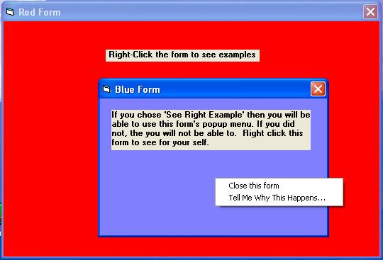



## Modal Form Popups

### Description

Shows how to launch forms modaly from popup menus while retaining the abailty to use popup menus on the new form. (Windows bug work-around)
 
### More Info
 
By the way... soon I will post how to unload a control during a drop down's click event. (Another Window's bug workaround)

             |
---                |---
**Submitted On**   |2005-03-16 20:36:02
**By**             |[sean oats](https://github.com/Planet-Source-Code/PSCIndex/blob/master/ByAuthor/sean-oats.md)
**Level**          |Intermediate
**User Rating**    |4.9 (34 globes from 7 users)
**Compatibility**  |VB 6\.0
**Category**       |[Miscellaneous](https://github.com/Planet-Source-Code/PSCIndex/blob/master/ByCategory/miscellaneous__1-1.md)
**World**          |[Visual Basic](https://github.com/Planet-Source-Code/PSCIndex/blob/master/ByWorld/visual-basic.md)
**Archive File**   |[Modal\_Form1865313162005\.zip](https://github.com/Planet-Source-Code/sean-oats-modal-form-popups__1-59510/archive/master.zip)

